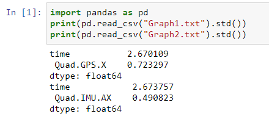
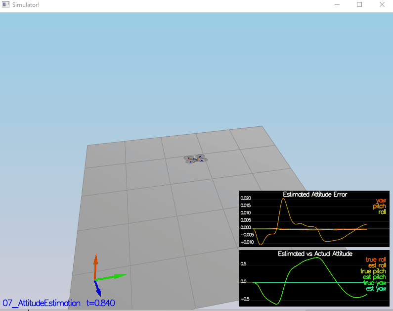
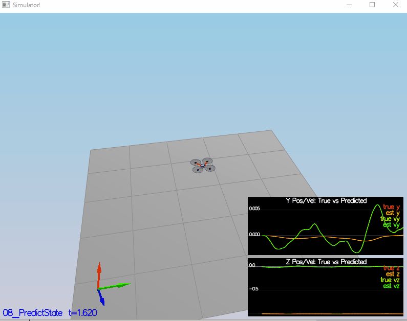
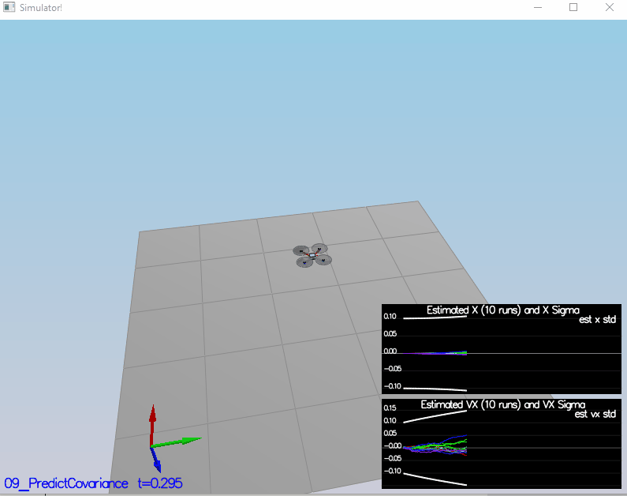
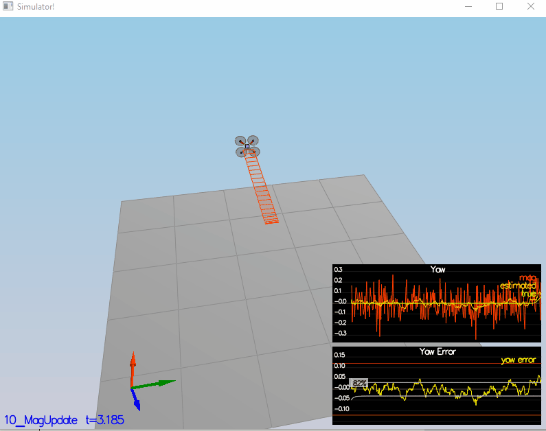
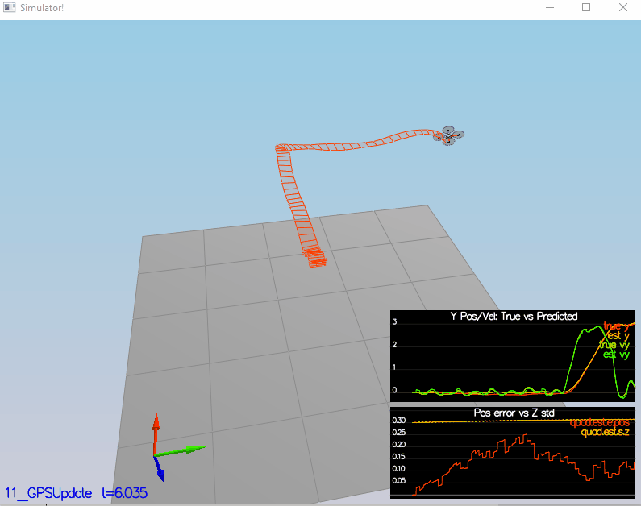

#### Provide a Writeup that includes all the rubric points and how you addressed each one. You can submit your writeup as markdown or pdf

You are reading it.

#### Determine the standard deviation of the measurement noise of both GPS X data and Accelerometer X data



I rounded the estimated noise to 0.7 for GPS.X and 0.5 for IMU.AX.

#### Implement a better rate gyro attitude integration scheme in the UpdateFromIMU() function

I implemented the nonlinear attitude filter by converting the Euler angles to quaternion and integrating using the quaternion in the inertia frame

```c++
void QuadEstimatorEKF::UpdateFromIMU(V3F accel, V3F gyro)
{
  Quaternion<float> q = Quaternion<float>::FromEuler123_RPY(rollEst, pitchEst, ekfState(6));
  q.IntegrateBodyRate(gyro, dtIMU);

  float predictedPitch = q.Pitch(), predictedRoll = q.Roll();
  ekfState(6) = q.Yaw();

  // normalize yaw to -pi .. pi
  if (ekfState(6) > F_PI) ekfState(6) -= 2.f*F_PI;
  if (ekfState(6) < -F_PI) ekfState(6) += 2.f*F_PI;

  // CALCULATE UPDATE
  accelRoll = atan2f(accel.y, accel.z);
  accelPitch = atan2f(-accel.x, 9.81f);

  // FUSE INTEGRATION AND UPDATE
  rollEst = attitudeTau / (attitudeTau + dtIMU) * (predictedRoll)+dtIMU / (attitudeTau + dtIMU) * accelRoll;
  pitchEst = attitudeTau / (attitudeTau + dtIMU) * (predictedPitch)+dtIMU / (attitudeTau + dtIMU) * accelPitch;

  lastGyro = gyro;
}
```

Results:



#### Implement all of the elements of the prediction step for the estimator

See function `QuadEstimatorEKF::PredictState` and `QuadEstimatorEKF::Predict` in `QuadEstimatorEKF.cpp` file.

```c++
VectorXf QuadEstimatorEKF::PredictState(VectorXf curState, float dt, V3F accel, V3F gyro)
{
  assert(curState.size() == QUAD_EKF_NUM_STATES);
  VectorXf predictedState = curState;

  Quaternion<float> attitude = Quaternion<float>::FromEuler123_RPY(rollEst, pitchEst, curState(6));

  accel = attitude.Rotate_BtoI(accel);
  predictedState.segment(3, 3) += (VectorXf(3) << accel.x, accel.y, accel.z - CONST_GRAVITY).finished()*dt;
  predictedState.segment(0, 3) += predictedState.segment(3, 3)*dt;
    
  return predictedState;
}

void QuadEstimatorEKF::Predict(float dt, V3F accel, V3F gyro)
{
  VectorXf newState = PredictState(ekfState, dt, accel, gyro);
  MatrixXf RbgPrime = GetRbgPrime(rollEst, pitchEst, ekfState(6));

  MatrixXf gPrime(QUAD_EKF_NUM_STATES, QUAD_EKF_NUM_STATES);
  gPrime.setIdentity();

  gPrime(0, 3) = gPrime(1, 4) = gPrime(2, 5) = dt;
  gPrime.block<3, 1>(3, 6) = RbgPrime * (VectorXf(3) << accel.x, accel.y, accel.z).finished()*dt;

  ekfCov = gPrime*ekfCov*gPrime.transpose() + Q;
  ekfState = newState;
}
```

#### Implement the magnetometer update

See function `QuadEstimatorEKF::UpdateFromMag` in file `QuadEstimatorEKF.cpp`

```c++
void QuadEstimatorEKF::UpdateFromMag(float magYaw)
{
  VectorXf z(1), zFromX(1);
  z(0) = magYaw;

  MatrixXf hPrime(1, QUAD_EKF_NUM_STATES);
  hPrime.setZero();

  hPrime(6) = 1;    
  zFromX(0) = fmodf(ekfState(6), 2 * M_PI);

  if (magYaw - zFromX(0) > M_PI) magYaw -= 2 * M_PI;
  else if (magYaw - zFromX(0) < -M_PI) magYaw += 2 * M_PI;
  z(0) = magYaw;

  Update(z, hPrime, R_Mag, zFromX);
}
```

#### Implement the GPS update

See function `QuadEstimatorEKF::UpdateFromGPS` from file `QuadEstimatorEKF.cpp`.

```c++
void QuadEstimatorEKF::UpdateFromGPS(V3F pos, V3F vel)
{
  VectorXf z(6), zFromX(6);
  z(0) = pos.x;
  z(1) = pos.y;
  z(2) = pos.z;
  z(3) = vel.x;
  z(4) = vel.y;
  z(5) = vel.z;

  MatrixXf hPrime(6, QUAD_EKF_NUM_STATES);
  hPrime.setZero();
  hPrime.block<6, 6>(0, 0).setIdentity();
  zFromX = ekfState.segment(0,6);

  Update(z, hPrime, R_GPS, zFromX);
}
```

#### Meet the performance criteria of each step










#### De-tune your controller to successfully fly the final desired box trajectory with your estimator and realistic sensors

Yes. (see the results above for Scenario 11).